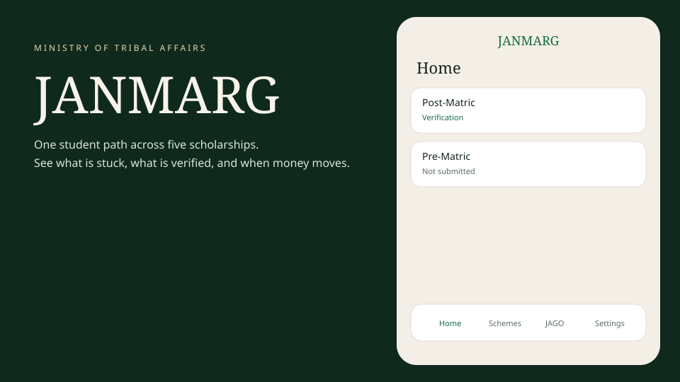
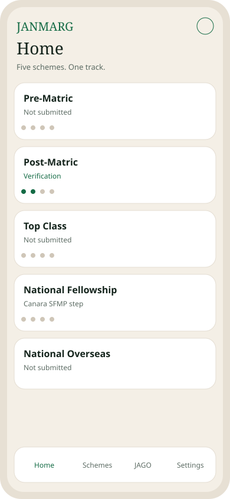
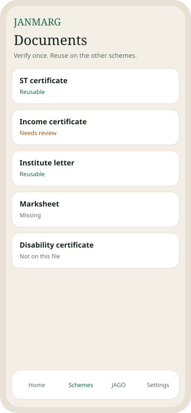
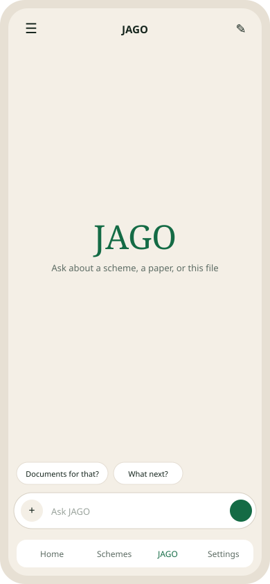
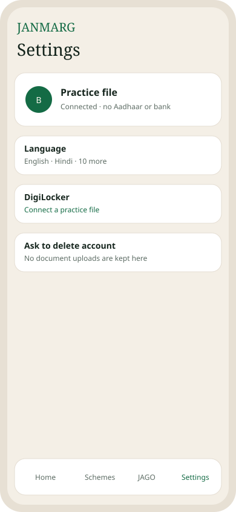

# JANMARG

**Jan Accessible Network for Mobilization, Accountability, Reform and Governance**

A working mobile-first Scholarship Module for Smart India Hackathon 2026.

| Field | Value |
|---|---|
| Problem statement | SIH26238 |
| Ministry | Ministry of Tribal Affairs |
| Category | Software |
| Theme | Smart Automation |
| Official scheme pages | [tribal.nic.in/ScholarshiP.aspx](https://tribal.nic.in/ScholarshiP.aspx) |
| Repository | [owais265/JANMARG](https://github.com/owais265/JANMARG) |

JANMARG gives one student one screen for five schemes that today live on three portals: the National Scholarship Portal (NSP), Direct Benefit Transfer (DBT), and the Canara Scholarship Fellowship Management Portal (SFMP), plus the standalone National Overseas Scholarship portal.

It is a **working prototype**. It is **not** an official government portal. It does not submit an application, does not decide eligibility, and does not show a bank credit as money sent.

---

## 1. Problem understanding

### 1.1 The five schemes and the three systems

MoTA administers five scholarship and fellowship schemes for Scheduled Tribe students:

| Scheme | Typical student | Where it lives today |
|---|---|
| Pre-Matric | Classes IX–X | NSP |
| Post-Matric | Class XI and above | NSP |
| Top Class | Selected higher-education institutes | NSP |
| National Fellowship (NFST) | M.Phil. / Ph.D. | Canara SFMP |
| National Overseas Scholarship (NOS) | Study abroad | Standalone NOS portal |

A student, or a family with children on different schemes, must open three logins to answer one question: *where is the file, and has any money moved?*

That split is not a UI inconvenience. Under the existing rule a student can avail **only one scheme at a time**. Without a unified view, a family can prepare a second application while the first is still live.

### 1.2 What the student actually does today

1. Find the correct portal for the scheme.
2. Re-enter identity, ST/PVTG status, income, institution and academic details.
3. Upload the same papers again because the last portal does not share a wallet.
4. Wait through verification with no single list of deficiencies.
5. Check sanction on one site and DBT status on another.
6. For NFST or NOS, start again on Canara SFMP or the overseas portal.
7. If a name or date does not match, the file often feels rejected instead of sent to review.

Verification is still mostly manual. The reform note already names the systems that could take that work: DigiLocker, AISHE, UDISE+, APAAR, UIDAI, State e-District systems and UGC-NTA. Those pipes are not issued to a student app today. The architecture has to look like them without pretending they are live.

### 1.3 The coverage gap

Students can be enrolled in school or college and still not be on a scholarship file. Matching registration with UDISE+, APAAR and OTR is how the ministry finds unreached beneficiaries. This repository designs that match as a coverage register. It does **not** run a live ministry census.

### 1.4 Who feels the cost

- The student who cannot see one journey from submission to disbursement.
- The parent tracking two children on two portals.
- The institute officer who asks for the same certificate a second time.
- The ministry desk that cannot see who is enrolled and not availing.

---

## 2. Expected solution mapped to this build

The problem statement asks for three products. This repository implements all three at prototype fidelity.

### 2.1 Scholarship Module

Unified dashboard covering all five schemes. The student tracks a file from **submission → verification → sanction → disbursement**.

Also in the module:

- Digital document wallet, with an optional DigiLocker connect
- Reuse of a document that has already been checked (verify once)
- Consolidated payments and DBT status
- Pending actions and deficiencies as alerts
- Profile and settings on the same phone column

### 2.2 JAGO chatbot

JAGO answers eligibility *information*, application status on the practice file, required documents, deficiencies and disbursement *status*. It is multilingual. It does not invent a sanction or a credit.

Student-specific answers come from the connected practice file first. Scheme rules come from reviewed public notes. If those two sources are silent, the model may compose a short reply and a policy gate still drops invented figures.

### 2.3 Unified verification and integration layer

Each source system is an adapter with the same shape: input, result, mismatch. A mismatch is routed to **manual review**, not treated as a reject. In this build the adapters are filled with practice data. The contract is the same one a live API would keep.

---

## 3. What a first-time user sees

The product is a phone app. On a desktop judge screen it sits as a 430px column on the right, with the JANMARG mark on the left.

| Step | Screen | What happens |
|---|---|---|
| 1 | Authentication | Full deep-green page. Logo and sign-in only. Guest continue, email, or Google / X when the visitor is not already signed in. |
| 2 | Guide | Six tap-anywhere cards: Dashboard, Schemes, Readiness, JAGO, Settings, DigiLocker. Skip is one tap. |
| 3 | Home | All five schemes as one track. Each scheme shows Submission, Verification, Sanction, Disbursement. Empty state is “Not submitted”, not a marketing card. |
| 4 | Documents | Wallet of papers on the practice file. Status: reusable, needs review, missing. |
| 5 | Payments | DBT row and Canara SFMP row. Amount is never shown as a credit that left a bank. |
| 6 | Alerts | Deficiency, name mismatch, document due. Bell on the header. |
| 7 | Settings | Profile, language, DigiLocker connect, account deletion request. |
| 8 | JAGO | Empty state is the wordmark. After the first message, two short follow-ups appear. History is a left drawer. New chat, delete thread, save text, save PNG. Picture and voice sit behind `+`. The assistant does not speak the reply. |

Bottom tabs: **Home · Schemes · JAGO · Settings**.

### Product screens

Desktop judges see the phone column on the right. The student only ever sees the phone.

<p align="center">
  
</p>

| Sign in | Home | Wallet |
|---|---|---|
|  |  |  |

| JAGO | Settings |
|---|---|
|  |  |

These frames follow the shipped UI: deep green authentication, cream phone column, four ministry stages, verify-once wallet, locker-first JAGO, DigiLocker in Settings.

---

## 4. Feature design, in depth

A scheme that has not been started is **Not submitted**. A started scheme shows Submission, Verification, Sanction and Disbursement. DigiLocker lives in Settings. A checked document can be reused. A mismatch goes to review. Payments are a status list, not a bank credit. JAGO is locker-first hybrid retrieval with a policy gate. The model key stays on the server.

Adapters for NSP, DBT, Canara SFMP, DigiLocker, AISHE, UDISE+, APAAR, UIDAI and UGC-NTA use one shape: match, mismatch or unavailable. Mismatch opens review. They are practice-filled in this build.

## 5. Run and deploy

```bash
npm install
npm run dev
```

Open `http://localhost:8080`. Then `npm test` and `npm run typecheck`.

Vercel environment variable name: `XAI_API_KEY`. Do not use `VITE_XAI_API_KEY`. Do not set `DATABASE_URL` if you want the published preview behaviour.

Team: Vercel **prograckers** / **jnmarg**. Supabase **mankmitra3.0**.

Official rules: [tribal.nic.in/ScholarshiP.aspx](https://tribal.nic.in/ScholarshiP.aspx).
